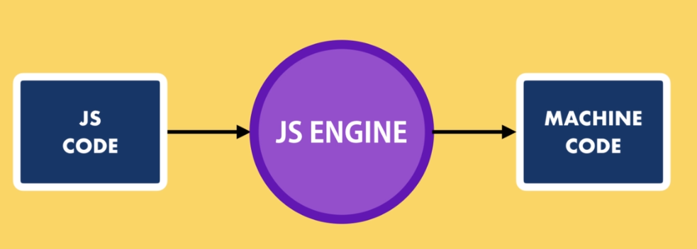
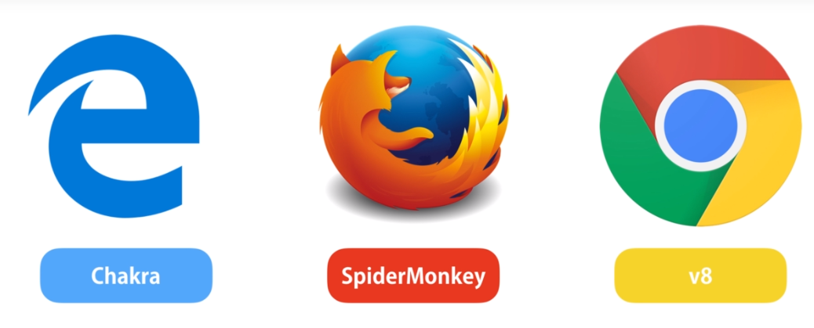
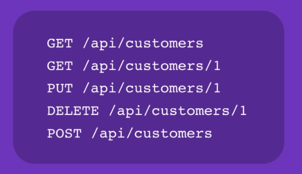
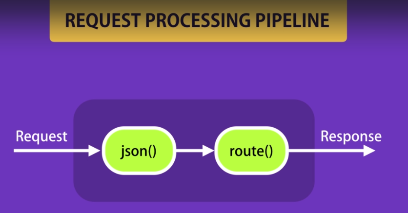

<a href="https://www.udemy.com/nodejs-master-class/" target="_blank">Link to the course</a>
-------------------------------------------------------------------------------------------------
<h1>Seção 01 - Getting Started</h1>

<h2>What is Node</h2>

A runtime environment for executing JavaScript code;
We often use Node to build back-end services, also called Application Programming Interface.
Web App and Mobile App communicate with API

Node is Highly-scalable, data-intensive and real-time apps.
Great for prototyping and agile development.
Superfast and higly scalable.
JavaScript everywhere
Cleaner and more consistent codebase
Large ecosystem of open-source libs

PayPal use this

A Node APP - Built twice as fast with fewer people;
		- 33% fewer lines of code;
		- 40% fewer files;
		- 2x request/sec;
		- 35% faster response time;

<h2>Node Architecture</h2>

What is a runtime environment really? 
Before Node we used javascript only to build applications that run inside a browser. 

A browser has a Javascript engine that takes our code and converts into code that a computer can undertand

JavaScript Engines of each Browser:

It's because of these varieties of engines, that javascript codes can behave differently in one browser or another.

In 2009 Ryan Dahl, creator of Node. He took google's v8 engine, which is the fastest JavaScript engine, and embedded it inside a C++ program and called that program Node. Node is a runtime environment for javascript code.
Both Chrome and Node share de same Javascript Engine.

Node is not a programming language!
Node is not a framework
It's a runtime environment for executing JavaScript code

<h2>How Node Works</h2>

Node is a non-blocking or asynchronous architecture.
Node applications are asynchronous by default.
Node is ideal for I/O-intensive apps.

Do not use Node for CPU-intensive apps like video encoding or an image manipulation service. In these king of applications, we have a lot of calculations that should be done by CPU, and few operations that touch the file system or the network.

--------------------------------------------------------------------------------------------
<h1>Seção 02 - Node Module System</h1>

<h2>Events Module</h2>
* A signal that something has happened
* Class called http and has the event request, that is listened by the module HTTP.

----------------------------------------------------------------------------
<h1>Seção 03 - Node Package Manager (NPM)</h1>

Share modules with NPM.
Command do install npm version 5.5.1
npm i -g npm@5.5.1

g for global

<h2>Package.json</h2>

* A json file that includes some basic information about your application or your project.

* run npm init
* or run npm init --yes (You dont need to answer the questions about your application)

<h2>Installing a node package</h2>
* npm install underscore or npm i underscore

<h2>Package Dependencies</h2>
* mongoose - We use this to store our data in MongoDB

<h2>NPM Packages and Source Control</h2>
* You do not need the node_modules folder, because all the dependencies are save in package.json. You just need run npm install to install all the modules to node_modules.

<h2>Semantic Versioning</h2>

* 4.13.6
* MajorVersion.MinorVersion.PatchVersion
* PatchVersion is for bug fixes
* MinorVersion is used for adding minor features that don't break the existing API
* MajorVersion is uded to add a new feature that could potentially break the existing applications

* ^4.13.6 //4.x
* ~1.8.3 //1.8.x

<h2>Listing the Installed Packaged</h2>

* To see all the versions of Installed Packaged you can see on the package.json file of module or simples run:
* npm list
* npm list --depth=0 //Only the dependencies of your application is using

<h2>Viewing Registry Info for a Package</h2>
* npm view mongoose
* npm view mongoose dependencies

<h2>Installing a Specific Version of a Package</h2>
* npm install mongoose@2.4.2
npm list --depth=0

<h2>Updating Local Packages</h2>
* npm outdated (Show all the versions who need to update)
* npm update
* npm i -g npm-check-updates (Install the major verions of a module)

<h2>DevDependencies</h2>
* npm i jshint --save-dev (Will be save with de properties devDependencie that is not used on production)

<h2>Uninstalling Packages</h2>
* npm uninstall mongoose
* npm un mongoose

<h2>Working with global packages</h2>
* npm is a example of a global project
* npm i -g npm@5.5.1
* npm i -g npm
* npm -g outdated (All modules are outdated - global)

<h2>Publishing a package</h2>
* npm adduser
* or if you have an account npm login
* you need to use a unic name of package name

<h2>Updating a Published Package</h2>
* You need to update a version of package
* npm version major
* npm version minor
* npm version patch
* all the commands to update the version of module

----------------------------------------------------
<h1>Seção 04 - Building RESTful API's Using Express</h1>

<h2>RESTful Services</h2>

* REST is short fr Representational State Transfer.
* REST is basically a convention for building these http services. We use simple http protocol principles to provide support to create, read, update and delete data. We refer to this operations all together as CRUD operations.

* HTTP METHODS
	* GET - Getting data
	* POST - Creating Data
	* PUT - Updating Data
	* DELETE - Deleting Data

<h2>Introducing Express</h2>
* Express is a Framework to build web applications.
* npm i express

<h2>Nodemon</h2>
* Node monitor
* npm i -g nodemon
* Use globaly
* instead using node index.js we will use nodemon index.js
* With nodemon we do not need to reestart the application (hot deploy)

<h2>Environment Variables</h2>

const port = process.env.PORT || 3000;

<h2>Input Validation</h2>
* npm i joi
* Joi we can define a schema
* Joi serves to validate erros and send to front

-------------------------------------------------------------------------------------------
<h1>Seção 05 - Express-Advanced Topics</h1>

<h2>Introducing</h2>
* In this sections
* Middleware
* Configuration
* Debugging
* Templating Engines

<h2>Middleware</h2>
* Middleware function is basically a function that takes a request object, and either returns a response to the client, or passes control to another Middleware function.

<h2>Third-party Middleware</h2>
* Every Middleware function will impact the performance of your application.

<h2>Environments</h2>
* export NODE_ENV=production //TO MacOS
* set NODE_ENV=production //TO WINDOWS

<h2>Configuration</h2>
* You do not store de password of database and secrets informations on configuration
* In file custom-environment-variables.json we define the mapping of configuration settings to environment variables.

<h2>Debugging</h2>
const startupDebugger = require('debug')('app:startup'); //SET OU EXPORT A VARIÁVEL DEBUG=app:startup
const dbDebugger = require('debug')('app:db');

*SET or EXPORT DEBUG=app:startup,app:db
or shortcut
* DEBUG=app:db nodemon index.js

<h2>Templating Engines</h2>
* All endpoints return json object, but sometimes we need to return html markup to the client and that's where we use a templating engine.
* Pug
* Mustache
* EJS

<h2>Database Integration</h2>
* You just need install a driver, and then you get a module with a simple API.

<h2>Authentication</h2>
* Outside of scope of express

---------------------------------------------------------------------------------------------------
<h1>Seção 06 - Asynchronous JavaScript</h1>

<h2>Patterns for Dealing with Asynchronous Code</h2>
* There are 3 patterns to lead with asynchronous code
* Callbacks
* Promises
* Async/await

<h2>Callbacks</h2>
* A callback is a function that we are going to call when the result of an asynchronous operation is ready.

<h2>Callback Hell</h2>
* When forms a Christmas Tree

<h2>Promises</h2>
* Holds the eventual result of an asynchronous operation.
* When an asynchronous operation completes, it can either result in a value or an error.

--------------------------------------------------------------------------------------------------------
<h1>Seção 07 - CRUD Operations Using MongoDB</h1>

<h2>Introducing MongoDB</h2>
* A document or NoSQL database.

<h2>Connecting to MongoDB</h2>
* Mongoose gives us a simple api to work with a MongoDB database.
* When you want to deploy your application to a production envirnment, you're going to have a different connection string for the production envirnment.

<h2>Schema</h2>
* We use a schema to define the shape of documents within a collection in MongoDB.
* Schema Types:
	* String
	* Number
	* Date
	* Buffer - Which we use for storing binary data
	* Boolean
	* ObjectID which is used for assigning unit identifiers
	* Array

--------------------------------------------------------------------------------------------
<h1>Seção 08 - Mongoose - Data Validation</h1>

<h2>Validation</h2>
* Mongoose who does the validations.
* MongoDB doens't care about validations.
* We will use joy for validation. Use Joy and Mongoose Validation.

---------------------------------------------------------------------------------------
<h1>Seção 09 - Mongoose - Modeling Relationships Between Connected Data</h1>

<h2>Transaction</h2>
* In SQL Databases we have the concept of transaction, which basically means a group of operations that should be performed as a unit. So either all these operations will complete and change the state of the database, or if something fails in the middle, all these operations that have been applied will be rolled back and our database will go back int he initate state. 

* Now, in MongoDB we don't have transactions as we have in these relational databases, we have a technique called two phase commit.

* npm i fawn

<h2>Validating Object ID's</h2>

* npm i joi-objectid

<h1>Seção 10 - Authentication and Authorization</h1>

<h2>Using Lodash</h2>
* npm i lodash

* For complexity passwords use:
* joi-password-complexity
* npm i joi-password-complexity

